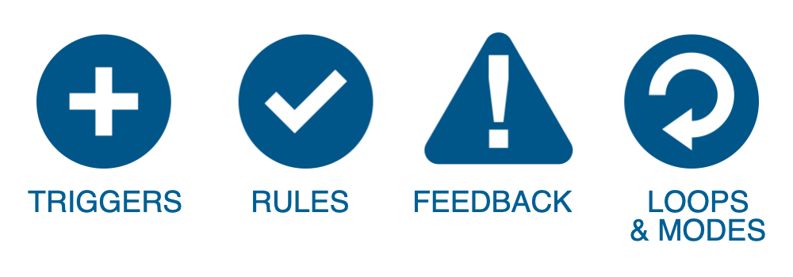

build-lists: true
footer: IDM 241: Microinteractions
slidenumbers: true
autoscale: true
theme: Work, 1
presenter-notes: text-scale(1), alignment(left), Helvetica

# IDM 241

## Microinteractions

### Week 2 - Anatomy of Microinteractions

---

## What are Microinteractions?

> A microinteraction is a contained product moment that revolves around a single use case—a tiny piece of functionality that only does one thing... Every time you change a setting, sync your data or devices, set an alarm, pick a password, turn on an appliance, log in, set a status message, or favorite or Like something, you are engaging with a microinteraction. 

- David Saffer (Microinteractions, OReilly)

---

## Microinteractions take place when you:

- Change a setting
- Sync your data/devices
- Log in
- Set a status message
- Like something
- Give a rating
- Export
- Format
- Make a calendar event
- Add a contact
- Search
- Make a comment

^ These are the kinds of interactions we as designer/developers often overlook or save until last, as an afterthought. All of these could be boring, nothing moments, or they could be thoughtful moments of delight.

---

## Microinteractions are good for...

- Accomplishing a single task
- Managing an ongoing task
- Connecting devices together
- Interacting with a single piece of data
- Controlling an ongoing process
- Adjusting a setting
- Viewing or creating a piece of content
- Turning a feature/function on or off

---

## Microinteractions do one task WELL

^ Microinteractions are contained product moments that revolve around a single use case. They have one main task. They are everywhere: in the devices we carry, the appliances in our house, the apps on our phones and desktops, even embedded in the environments we live and work in.

---

# Microinteractions should focus on the details that delight.

---

## The Structure of Interactions

^ Triggers, Rules, Feedback, Loops & Modes

---

## Triggers

Triggers initiate the microinteraction

^ (a.k.a events). Click, Touch, Hover, Shake, Motion Senors, etc.

---

## Rules

The rules determine how the microinteraction works

^ After the user touches a button what should happen in detail.

---

## Feedback

The feedback illuminates the rules for the user

- Visual
- Aural
- Haptic

---

## Loops & Mode

The meta rules that affect the microinteraction.

^ An example of a loop. On eBay, if you’ve bought the same item in the past, the buy button changes from "Buy it now" to "Buy another."

---

## Elegant Microinteractions

### Elegant microinteractions can be become SIGNATURE MOMENTS for your application.

---

## Online examples

## [fit] instagram.com -vs- tumblr.com

Let's compare and constrast some of the microinteractions of instagram vs tumblr

^ Professor shares screen and compares microinteraction structures of  Heart, Comment etc.

---

## Classroom exercise

- Find a web site that has at least one interesting microinteraction. (15 minutes)
- Add a link to that site to zoom chat window. (10 minutes)
-- NOTE: NO repeats, if that domain is already posted find another one!
- Be prepared to share your screen and identify the structure of said microinteraction to the rest of the class. (5 minutes or less per student)
-- Trigger, Rules, Feedback and loop/Modes.

^ i.e. No one can use instagram or tumblr since I already used them in classroom examples.

---

# IDM 241

## Microinteractions

### Week 2 - Anatomy of Microinteractions